# VulnX Security Scanner - Complete Port Scanning Workflow

## Flowchart Diagram

```mermaid
graph TD
    A["👤 User Input<br/>Target IP/Hostname<br/>Scan Type Selection"] -->|Submit Form| B["🔌 WebSocket Event<br/>Browser emits<br/>start_scan"]
    
    B -->|Flask receives event| C["🔍 DNS Resolution<br/>Validate IP Format<br/>IPv4 vs IPv6 Detection"]
    
    C -->|Resolution Success| D{Address Type?}
    C -->|Resolution Failed| Z["❌ Error<br/>Send failure message<br/>Abort scan"]
    
    D -->|IPv4 Detected| E["🔗 Socket Family<br/>AF_INET<br/>socket.AF_INET"]
    D -->|IPv6 Detected| F["🔗 Socket Family<br/>AF_INET6<br/>socket.AF_INET6"]
    
    E --> G["📋 Port Queue Creation<br/>Select Port Range<br/>Quick: 23 ports<br/>Deep: 1-65535"]
    F --> G
    
    G --> H["⚡ Thread Pool init<br/>Quick Scan: 100 threads<br/>Deep Scan: 500 threads"]
    
    H --> I["🔄 Multi-threaded Scan<br/>Worker threads pop ports<br/>socket.connect_ex<br/>Check port open"]
    
    I --> J{Port Open?}
    
    J -->|No| K["➡️ Continue<br/>Next port in queue"]
    K --> I
    
    J -->|Yes| L["🎣 Banner Grab<br/>TCP connection<br/>Receive response<br/>HTTP header parse"]
    
    L --> M["🏷️ Service Identification<br/>Match port → service<br/>FTP, SSH, HTTP, etc"]
    
    M --> N["⚠️ Severity Mapping<br/>Critical/High/Medium/Low<br/>Threat assessment<br/>Remediation guide"]
    
    N --> O["📡 Real-time WebSocket Update<br/>Emit 'port_found'<br/>Browser renders card<br/>Progress bar update"]
    
    O --> P{More Ports?}
    
    P -->|Yes| I
    P -->|No| Q["✅ Scan Complete<br/>Aggregate results<br/>Sort by port number"]
    
    Q --> R["💾 Save to History<br/>JSON persistence<br/>scan_history.json<br/>Max 50 scans"]
    
    R --> S["🎨 UI Rendering<br/>Display result cards<br/>Enable export/report<br/>Show summary"]
    
    S --> T["🏁 Ready for Next Action<br/>User can:<br/>- Click card for AI analysis<br/>- Export report<br/>- Start new scan"]
    
    Z --> W["🔴 User Notification<br/>Display error message<br/>Clear UI state"]
    
    style A fill:#10b981,stroke:#059669,stroke-width:3px,color:#fff
    style B fill:#3b82f6,stroke:#1d4ed8,stroke-width:2px,color:#fff
    style C fill:#8b5cf6,stroke:#6d28d9,stroke-width:2px,color:#fff
    style D fill:#f59e0b,stroke:#d97706,stroke-width:2px,color:#fff
    style E fill:#06b6d4,stroke:#0891b2,stroke-width:2px,color:#fff
    style F fill:#06b6d4,stroke:#0891b2,stroke-width:2px,color:#fff
    style G fill:#ec4899,stroke:#be185d,stroke-width:2px,color:#fff
    style H fill:#f97316,stroke:#c2410c,stroke-width:2px,color:#fff
    style I fill:#6366f1,stroke:#4f46e5,stroke-width:2px,color:#fff
    style J fill:#fbbf24,stroke:#f59e0b,stroke-width:2px,color:#000
    style K fill:#94a3b8,stroke:#64748b,stroke-width:2px,color:#fff
    style L fill:#14b8a6,stroke:#0d9488,stroke-width:2px,color:#fff
    style M fill:#22c55e,stroke:#16a34a,stroke-width:2px,color:#fff
    style N fill:#84cc16,stroke:#65a30d,stroke-width:2px,color:#fff
    style O fill:#a78bfa,stroke:#7c3aed,stroke-width:2px,color:#fff
    style P fill:#fbbf24,stroke:#f59e0b,stroke-width:2px,color:#000
    style Q fill:#10b981,stroke:#059669,stroke-width:2px,color:#fff
    style R fill:#3b82f6,stroke:#1d4ed8,stroke-width:2px,color:#fff
    style S fill:#8b5cf6,stroke:#6d28d9,stroke-width:2px,color:#fff
    style T fill:#10b981,stroke:#059669,stroke-width:3px,color:#fff
    style Z fill:#ef4444,stroke:#dc2626,stroke-width:2px,color:#fff
    style W fill:#f87171,stroke:#dc2626,stroke-width:2px,color:#fff
```



## Workflow Stages

### Stage 1: Initiation 🟢
- **User Input** → Form submission with target and scan type
- **WebSocket Event** → Browser emits real-time connection to Flask

### Stage 2: Validation 🟣
- **DNS Resolution** → Validates IP format and resolves hostnames
- **Error Path** → Aborts if resolution fails
- **Address Type Detection** → IPv4 vs IPv6 automatic selection

### Stage 3: Setup 🟠
- **Socket Family Selection** → AF_INET or AF_INET6
- **Port Queue Creation** → Determines scan scope (23 or 65,535 ports)
- **Thread Pool Init** → 100 or 500 worker threads based on scan type

### Stage 4: Scanning 🔵
- **Multi-threaded Scan** → Workers pop ports from queue
- **Connection Testing** → socket.connect_ex() for each port
- **Decision Point** → Is port open?

### Stage 5: Analysis 🟤
- **Banner Grabbing** → TCP handshake and response capture
- **Service Identification** → Port to service mapping
- **Severity Mapping** → Critical/High/Medium/Low assessment

### Stage 6: Real-time Communication 💜
- **WebSocket Update** → Live progress to browser
- **Loop check** → Continue scanning remaining ports
- **Scan Completion** → Aggregate and sort results

### Stage 7: Persistence 🔵
- **Save to History** → JSON file storage (max 50 scans)
- **UI Rendering** → Display result cards dynamically

### Stage 8: Completion 🟢
- **Ready for Actions** → User can analyze, export, or scan again

---

## Key Technologies

| Component | Technology | Purpose |
|-----------|-----------|---------|
| Frontend Communication | WebSocket / Socket.IO | Real-time event streaming |
| Threading | Python Threading | 100-500 concurrent port checks |
| Network API | Python Socket API | IPv4/IPv6 TCP connections |
| Storage | JSON File | Persistent scan history |
| Server | Flask + SocketIO | Backend application server |
| Frontend | HTML/CSS/JavaScript | User interface |

---

## Download Instructions

### View with Mermaid
1. Copy this file content
2. Go to [Mermaid Live Editor](https://mermaid.live)
3. Paste the diagram code
4. Export as SVG, PNG, or PDF

### Use in Documentation
- Save this file as `VULNX_SCANNING_WORKFLOW.md`
- Include in your project documentation
- Render automatically on GitHub/GitLab

### Generate Images
```bash
# Install mermaid-cli
npm install -g @mermaid-js/mermaid-cli

# Generate PNG
mmdc -i VULNX_SCANNING_WORKFLOW.md -o workflow.png

# Generate SVG
mmdc -i VULNX_SCANNING_WORKFLOW.md -o workflow.svg -t dark

# Generate PDF
mmdc -i VULNX_SCANNING_WORKFLOW.md -o workflow.pdf
```

---

**Generated:** February 26, 2026  
**Project:** VulnX Security Scanner  
**Version:** 1.0
